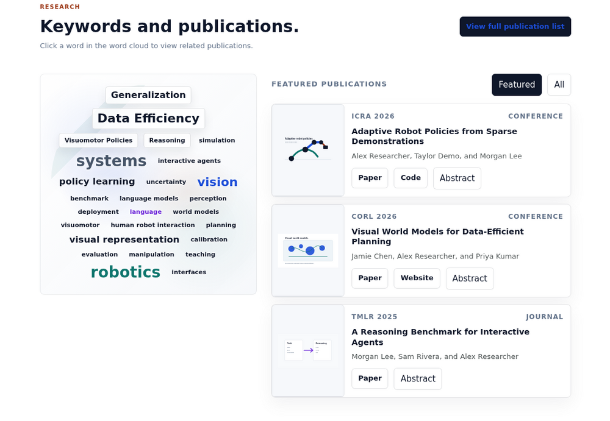
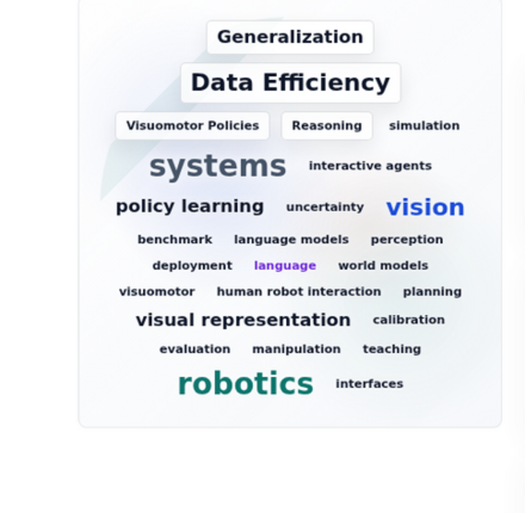
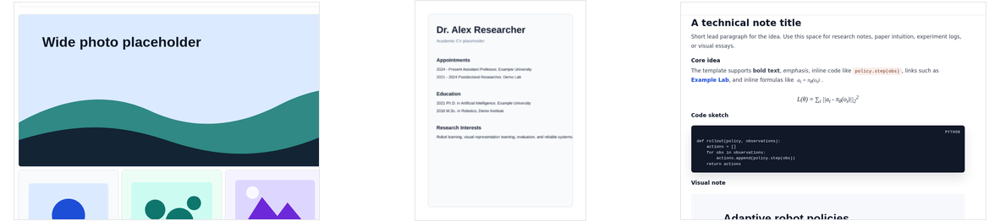
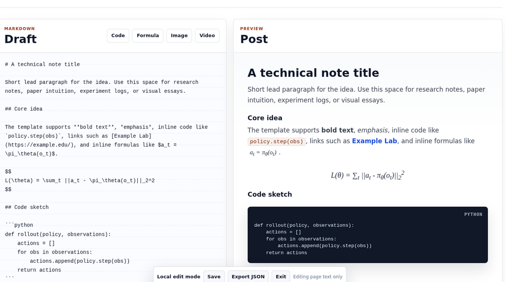

# Academic Portfolio Website Template

A static, GitHub Pages friendly academic website template for research profiles,
publications, CVs, writing, and photo galleries. The template branch uses pseudo
content, demo SVGs, and example publication data. Replace them with public
material before publishing.

The root `.nojekyll` file is kept so GitHub Pages serves filenames that begin
with `_`, which is common for camera exports.


## Features

- Auto-import publications from a Google Scholar profile or a saved Scholar HTML
  page, then rebuild the publication list and keyword data.

  

- Interactive keyword cloud generated from paper keywords, with click-to-filter
  publication lookup.

  

- Photo gallery, scrollable CV page, and compiled Markdown blog page.

  

- Localhost-only online text editing with `?edit=1`, backed by
  `data/site-content.json`.

  

- Mobile-compatible layout, including the compact profile card, responsive
  navigation, maps, publication cards, and gallery.

  

## Quick Start

Preview the static site:

```sh
python3 -m http.server 8000
```

Preview with in-place text editing:

```sh
npm run dev
```

Then open:

```text
http://localhost:8000/?edit=1
```

Edit mode only runs on localhost. With `npm run dev`, text edits are saved to
`data/site-content.json`; with a plain static server, the browser downloads a
JSON backup because it cannot write files directly.

## Key Files

- `index.html`: homepage, profile sidebar, keyword cloud, selected publications,
  education map, activities, and contact.
- `publications.html`: generated full publication list.
- `cv.html`: scrollable CV page rendered from public SVG pages.
- `life.html`: generated photo gallery page.
- `blog.html`: compiled Markdown post page; the Markdown editor appears only in
  localhost edit mode.
- `data/publications.json`: publication source data.
- `data/research-keywords.json`: highlighted keyword definitions.
- `data/site-content.json`: editable page text.
- `scripts/`: build, import, gallery, local server, and audit helpers.

## Publications

Edit `data/publications.json` directly, or import from Google Scholar:

```sh
npm run import:scholar -- --profile "https://scholar.google.com/citations?user=SCHOLAR_ID&hl=en"
```

If Scholar blocks automated access, save your Scholar profile page as HTML and
run:

```sh
npm run import:scholar -- --from-html scholar-profile.html
```

Imported entries usually need manual cleanup for abstracts, PDFs, teaser images,
and project links.

After changing publications, rebuild:

```sh
npm run build:publications
npm run build:keywords
```

or run every build step:

```sh
npm run build
```

## Keyword Cloud

The homepage keyword cloud is generated from paper keywords and tags in
`data/publications.json`. Highlighted words and display labels live in
`data/research-keywords.json`.

Rebuild the paper-to-keyword lookup with:

```sh
npm run build:keywords
```

## Photo Gallery

Add public photos to `images/oc`, then run:

```sh
npm run build:life
```

The gallery supports `jpg`, `jpeg`, `png`, `gif`, `webp`, and `svg`. Raster
images get compressed WebP thumbnails in `images/oc-thumbs`; the original files
remain available in the full-screen lightbox. Files beginning with `profile_` or
`profile-` are skipped.

## CV And Blog

Replace the demo SVG pages in `images/cv-pages/` with exported pages from your
public CV. Add a public PDF in `pdfs/` only if you want a download link.

The Blog page renders Markdown as a polished post by default. Open
`blog.html?edit=1` on localhost to reveal the Markdown editor, snippet buttons,
and live preview.

## Checks

Run before pushing:

```sh
npm run check
```

The audit checks JavaScript syntax, required files, local references, visible
Blog navigation, and whether `life.html` is synchronized with `images/oc`.

## Privacy Notes

Keep private CV drafts, raw PDFs, source documents, notes, raw photos, and
unselected images in ignored folders listed in `.gitignore`, such as `.pdfs/`,
`pdfs/private/`, `images/private/`, and `images/originals/`.

Only put files in public folders when they are intended to be published by
GitHub Pages. The ignore file does not strip metadata from images that are
already committed.
